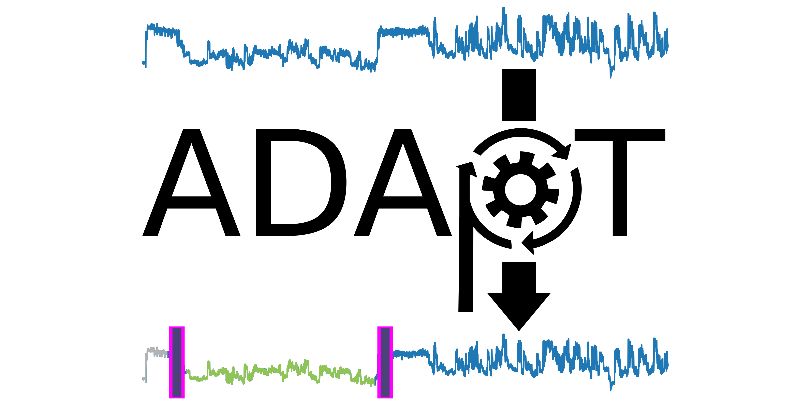

# ADAPTed - Adapter and poly(A) Detection And Profiling Tool

ADAPTed is a software tool that detects and profiles DNA adapters and poly(A) tails in dRNA-seq data.

Note: due to a naming conflict, the tool has been renamed from ADAPT to ADAPTed.

## Installation

To install ADAPTed, the conda/mamba environment must be installed first. To do so, you can run the following commands:

```
git clone https://github.com/wvandertoorn/ADAPTed.git
cd ADAPTed
mamba env create -f environment.yml
conda activate ADAPTed
```

Then, to install ADAPTed, run the following commands:

```
pip install .
```

## Usage

You can use ADAPTed by running the following command:

```
adapted detect --input INPUT [INPUT ...] --output OUTPUT --chemistry CHEMISTRY
```

Where `input` contains the pod5 files/directories to process, `output` specifies the location to create the output folder, and `chemistry` is 'RNA002' or 'RNA004'. Specifying the chemistry automatically selects the latest config file for that chemistry (ADAPTed currently supports `rna002_70bs` or `rna004_130bps`). Alternatively, you can specify a custom config TOML using the `--config` flag (see `adapted/config/config_files/` for examples).

For additional options, see `adapted --help` and `adapted detect --help`.

### Continue from previous run

You can continue from a previous incomplete run by using the `continue` subcommand. This is useful if the run was interrupted. When you want to continue with different performance parameters (batch size, number of processes, etc.), you can edit these variables in the `command.json` file in the output folder of the previous run prior to continuing. Take care to not overwrite any of the processing parameters, as this may cause the run to fail.

```
adapted continue /path/to/previous/run/output
```

## Input

ADAPTed supports pod5 files as input (<https://pod5-file-format.readthedocs.io/en/latest/>). These files are generated by the MinKNOW software and contain the raw signal data of the sequencing run.

## Output

- `detected_boundary_XX.csv` : contains information on detected adapter and poly(A) boundaries.
- `failed_reads_XX.csv` : contains information on reads for which no adapter was detected.
- `command.json` : contains the command line arguments used to run ADAPTed.
- `config.toml` : contains the signal processing configuration used to run ADAPTed.
- `adapted.log` : contains the log messages generated during the run.

### Result files

ADAPTed outputs 'detected_boundary_XX.csv' files, containing information on detected adapter and poly(A) boundaries.
Reads for which no adapter was detected, are described in the 'failed_reads_XX.csv' files.

These files contain the following columns:

- `read_id` : the read ID of the read.
- `signal_len` : the length of the read, in number of samples in the raw signal.
- `preloaded` : the length of the preloaded signal, in number of samples in the raw signal.
- `adapter_start` : the start coordinate of the adapter signal in the raw signal.
- `adapter_end` : the end coordinate of the adapter signal, in the raw signal.
- `adapter_len` : the length of the adapter signal, in number of samples in the raw signal.
- `adapter_mean` : the mean of the adapter signal, in pico amperes.
- `adapter_std` : the standard deviation of the adapter signal, in pico amperes.
- `adapter_med` : the median of the adapter signal, in pico amperes.
- `adapter_mad` : the median absolute deviation of the adapter signal, in pico amperes.
- `polya_start` : the start coordinate of the poly(A) signal in the raw signal.
- `polya_end` : the end coordinate of the poly(A) signal, in the raw signal.
- `polya_len` : the length of the poly(A) signal, in number of samples in the raw signal.
- `polya_mean` : the mean of the poly(A) signal, in pico amperes.
- `polya_std` : the standard deviation of the poly(A) signal, in pico amperes.
- `polya_med` : the median of the poly(A) signal, in pico amperes.
- `polya_mad` : the median absolute deviation of the poly(A) signal, in pico amperes.
- `polya_truncated` : whether the poly(A) signal was truncated by the signal preload logic during detection.
- `polya_candidates` : candidate positions for poly(A) tail detection.
- `rna_preloaded_start` : the start coordinate of the RNA signal in the raw signal.
- `rna_preloaded_len` : the length of the preloaded RNA signal, in number of samples.
- `rna_preloaded_mean` : the mean of the preloaded RNA signal, in pico amperes.
- `rna_preloaded_std` : the standard deviation of the preloaded RNA signal, in pico amperes.
- `rna_preloaded_med` : the median of the preloaded RNA signal, in pico amperes.
- `rna_preloaded_mad` : the median absolute deviation of the preloaded RNA signal, in pico amperes.
- `start_peak_idx` : index of the initial peak detection.
- `start_peak_pa` : pico ampere value at the initial peak.
- `start_peak_next_max_idx` : index of the next maximum peak.
- `start_peak_next_max_pa` : pico ampere value at the next maximum peak.
- `start_peak_open_pore_idx` : index of open pore detection from initial peak analysis.
- `start_peak_open_pore_type` : type of open pore event detected.
- `adapter_rna_median_shift` : median shift between adapter and RNA signals.
- `llr_adapter_end` : log likelihood ratio-detected adapter end coordinate.
- `llr_polya_end` : log likelihood ratio-detected poly(A) end coordinate.
- `cnn_adapter_end` : CNN-detected adapter end coordinate.
- `cnn_polya_end` : CNN-detected poly(A) end coordinate.
- `start_peak_adapter_end` : adapter end coordinate from peak detection.
- `start_peak_polya_end` : poly(A) end coordinate from peak detection.
- `llr_adapter_end_adjust` : adjustments to adapter end coordinate in LLR refinement.
- `llr_polya_end_adjust` : adjustments to poly(A) end coordinate in LLR refinement.
- `llr_trace_early_stop_pos` : position where trace calculation stopped early.
- `mvs_llr_polya_end_adjust_ignored` : whether poly(A) end adjustment was ignored in MVS method.
- `mvs_llr_polya_end_to_early_stop` : if true, poly(A) end was set to early stop position.
- `mvs_adapter_end` : adapter end coordinate from mean-variance-shift method.
- `mvs_detect_mean_at_loc` : local mean at detection position.
- `mvs_detect_var_at_loc` : local variance at detection position.
- `mvs_detect_polya_med` : median of poly(A) signal from MVS detection.
- `mvs_detect_polya_local_range` : local range of poly(A) signal from MVS detection.
- `mvs_detect_med_shift` : median shift detected by MVS method.
- `real_adapter_mean_start` : mean of adapter signal at start window.
- `real_adapter_mean_end` : mean of adapter signal at end window.
- `real_adapter_local_range` : local range of adapter signal.
- `open_pores` : detected open pore events.
- `llr_detect_log` : log messages from LLR detection process.

## Signal preloading

ADAPTed first preloads the first N samples of the signal into memory, and then detects the adapter signal.
Sometimes, the adapter signal is longer than the preload size, this will lead to the detection failing.
Sometimes, the adapter+polyA signal is longer than the preload size, this will lead to the detection succeeding, but the polyA signal will be truncated which is of concern for downstream analysis when the length or statistics of the polyA signal are of interest.
If this is the case, we advise to run the tool once with default settings, and rerun it for truncated polyA reads with `--max_obs_trace` set to a larger value. You can use the `get_truncated.sh` script to easily obtain the truncated reads.

```
bash scripts/get_truncated.sh /directory/containing/detected/boundaries/files
adapted detect [OPTIONS] --read_id_csv /directory/containing/detected/boundaries/files/truncated_read_ids.csv --max_obs_trace VALUE
```

Depending on your poly(A) length distribution, and whether you polyadenylated your reads, choose a suitable value for `--max_obs_trace`.
A sensible value could be 1.5 or 2 times the default value, for example.

The same workflow could be applied to failed reads and may increase yield.

In all cases, it is important to note that the statistics on the rna signal (`rna_preloaded_mean`, `rna_preloaded_std`, `rna_preloaded_med`, `rna_preloaded_mad`, `rna_preloaded_len`) are based on the preloaded signal, and may not reflect the actual signal.

## Poly(A) tail length estimation

ADAPTed is capable of determining the length of the adapter and poly(A) tail in number of samples in the raw signal. This information can be combined to estimate the length of the poly(A) tail in number of bases: given the fixed length of the adapter sequence, the determined adapter length in number of samples can be used to estimate the translocation speed of the molecule. The poly(A) length in bases is then estimated by dividing the determined poly(A) length in number of samples by the translocation speed.

You can use the `resegment` workflow in our other tool ([WarpDemuX](https://github.com/KleistLab/WarpDemuX)) to obtain the median and median absolute deviation adapter event length per read.

## License

This project is licensed under the Creative Commons Attribution-NonCommercial 4.0 International License (CC BY-NC 4.0). You can view the full text of the license at the following link:
<https://creativecommons.org/licenses/by-nc/4.0/legalcode>
